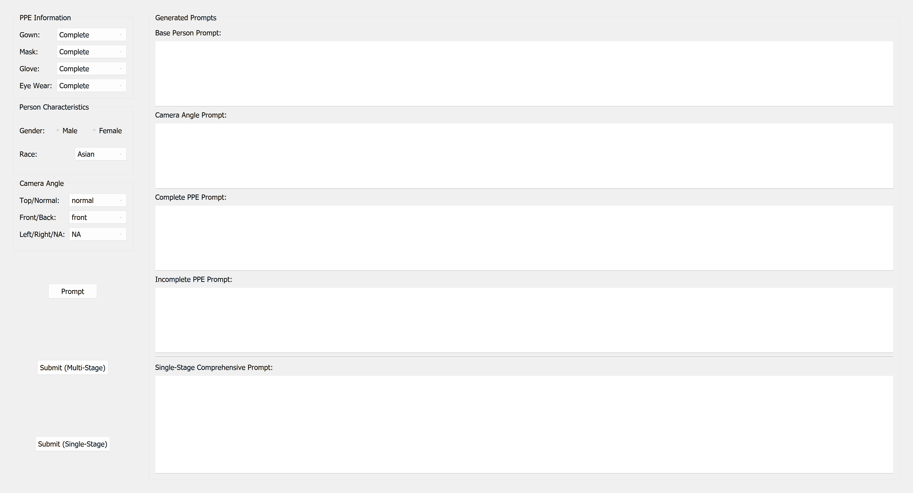
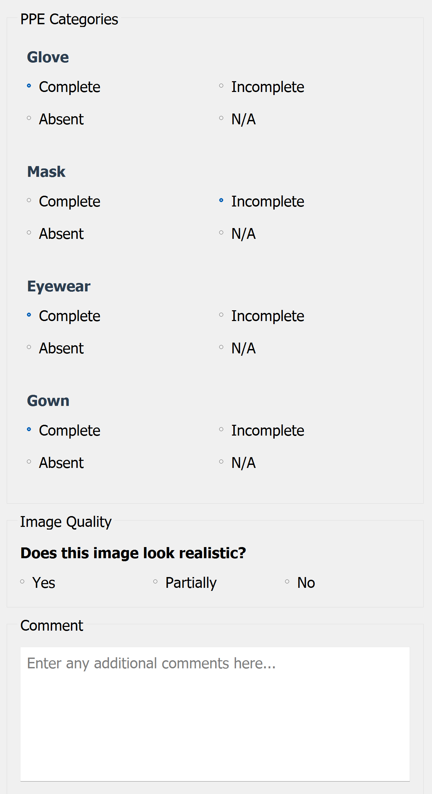

# Controllable Synthetic Human Generation with Semantic Verification for PPE Analysis

Official implementation of the paper:
**"Controllable Synthetic Human Generation with Semantic Verification for PPE Analysis"**

---

## Overview

This repository provides a pipeline for generating **controllable synthetic images of healthcare workers (HCWs)** with specified PPE (Personal Protective Equipment) configurations, along with automated semantic verification to ensure generated images match their intended labels.

The system addresses a core challenge in PPE compliance research: the scarcity of labelled real-world images covering the full spectrum of PPE states (complete, incomplete, absent) across diverse human demographics and camera viewpoints. By using a generative image model (Google Gemini) with structured prompt engineering and LLM-based verification, the pipeline produces annotated synthetic training data at scale.

### Key Capabilities

- **Controllable generation** — specify PPE status, person demographics, and camera angle per image
- **Two generation modes** — a multi-stage image-editing pipeline and a single-stage approach
- **Semantic verification** — an LLM judge checks each generated image against its intended annotation
- **Human validation tool** — a lightweight GUI for manual review and quality scoring
- **Batch automation** — generate and validate hundreds of images with a single command

---

## System Architecture

### Generation Modes

**Multi-Stage Pipeline** (primary method):

```
Text-to-Image          Image-to-Image        Image-to-Image         Image-to-Image
[Base HCW prompt]  →  [Camera angle edit] →  [Complete PPE edit] →  [Incomplete PPE edit]
     Step 1                Step 2                  Step 3                  Step 4
```

Each stage refines the previous output via image-conditioned generation, allowing precise, independent control over person appearance, viewpoint, and each PPE item.

**Single-Stage Pipeline** (baseline comparison):

```
Text-to-Image
[Comprehensive merged prompt]  →  [Final image]
```

All attributes are described in a single prompt, with no iterative editing.

### Semantic Verification

After generation, a Gemini LLM inspects each image and reports the detected status of each PPE item (`complete` / `absent` / `incomplete`), which is compared against the generation annotation. Images that fail verification can be filtered before use in downstream training.

---

## Controllable Attributes

| Attribute | Options |
|---|---|
| **Gown** | Complete / Incomplete / Absent |
| **Mask** | Complete / Incomplete / Absent |
| **Glove** | Complete / Incomplete-Left / Incomplete-Right / Absent |
| **Eyewear** | Complete / Incomplete / Absent |
| **Gender** | Male / Female |
| **Race** | Asian / Black / White / Hispanic / Other |
| **Camera elevation** | Normal / Top-down |
| **Camera facing** | Front / Back |
| **Camera lateral** | N/A / Left / Right |

---

## Repository Structure

```
.
├── srcs/
│   ├── automate_generation.py       # Batch generation + LLM validation (main entry point)
│   ├── UI/
│   │   ├── synthetic_UI.py          # PyQt5 GUI for interactive single-image generation
│   │   ├── prompt_generator.py      # Multi-stage prompt construction
│   │   ├── single_stage_prompt_generator.py  # Single-stage prompt construction
│   │   └── nano_banana_api.py       # Gemini API wrapper (t2i / it2i)
│   ├── gemini/
│   │   └── nano_banana_api.py       # Standalone Gemini API module
│   └── validation/
│       ├── validation_LLM.py        # LLM-based semantic verification
│       ├── validation_human.py      # Human review GUI
│       └── validation_human_modified.py  # Extended human review GUI
├── configs/
│   └── config_example.json          # Example batch configuration
├── docs/
│   ├── AUTOMATION_README.md         # Detailed automation guide
│   ├── README_Validation_Tool.md    # Human validation tool guide
│   ├── Instructions_Mac.pdf         # macOS setup instructions
│   └── Instructions_Windows.pdf     # Windows setup instructions
├── ui_captures/                     # Screenshots of the UI
├── sample_images/                   # Example generated images
└── .gitignore
```

---

## Installation

**Requirements:** Python 3.8+

```bash
pip install PyQt5 google-generativeai pillow
```

A **Google Gemini API key** is required for image generation and LLM verification. You can obtain one from [Google AI Studio](https://aistudio.google.com/). Pass it via the `--api-key` flag or set the `GEMINI_API_KEY` environment variable — do not hard-code keys in source files.

---

## Usage

### Interactive UI (single image)

```bash
cd srcs/UI
python synthetic_UI.py
```

Select PPE status, person characteristics, and camera angle from the form. Click:
- **Prompt** — preview the generated prompts
- **Submit (Multi-Stage)** — run the 4-step generation pipeline
- **Submit (Single-Stage)** — run the single-prompt baseline

Output images are saved to `output/` with paired annotation JSON files in `output_annotation/`.

### Batch Automation

`automate_generation.py` imports from `synthetic_UI.py`, so it must be run from `srcs/UI/` (where `synthetic_UI.py` lives):

```bash
cd srcs/UI

# Generate 100 images with a config file, then validate
python ../automate_generation.py --total 100 --config ../../configs/config_example.json --api-key YOUR_KEY

# Generate only (skip validation)
python ../automate_generation.py --total 100 --config ../../configs/config_example.json --skip-validation

# Validate only (images already exist)
python ../automate_generation.py --total 0 --skip-generation --api-key YOUR_KEY
```

### Human Validation

```bash
cd srcs/validation
python validation_human_modified.py
```

Select a folder of generated images and an output folder. For each image, rate each PPE item and overall image realism. Results are saved as one JSON file per image.

See `docs/README_Validation_Tool.md` for full usage instructions.

---

## Configuration File Format

Batch runs accept a JSON file specifying the desired count of each attribute value. Unspecified fields are randomized.

```json
{
  "generation_mode": "single_stage",
  "gown":    { "Complete": 30, "Incomplete": 20, "Absent": 10 },
  "mask":    { "Complete": 35, "Incomplete": 15, "Absent": 10 },
  "glove":   { "Complete": 25, "Incomplete-Left": 10, "Incomplete-Right": 10, "Absent": 15 },
  "eyewear": { "Complete": 30, "Incomplete": 15, "Absent": 15 },
  "gender":  { "Male": 30, "Female": 30 },
  "race":    { "Asian": 15, "Black": 15, "White": 15, "Hispanic": 10, "Other": 5 },
  "camera_top_normal":  { "normal": 40, "top": 20 },
  "camera_front_back":  { "front": 35, "back": 25 },
  "camera_left_right":  { "NA": 30, "left": 15, "right": 15 }
}
```

Set `"generation_mode"` to `"multi_stage"` (default) or `"single_stage"`.

---

## Output Structure

```
output/                          # Generated images  (HCW_YYYYMMDD_HHMMSS.png)
output_annotation/               # Paired annotation JSON files
YYYYMMDD_HHMMSS_validation_record.json   # Batch validation report
logs/                            # Automation run logs
```

Each annotation JSON records the full generation configuration (PPE states, demographics, camera angle, timestamp) for use as ground-truth labels in downstream tasks.

---

## UI Screenshots

| Generation UI | Human Validation UI |
|---|---|
|  |  |

---

## Citation

Citation details will be updated upon publication.
If you use this code in your research, please cite:

```bibtex
@article{controllable_synthetic_ppe,
  title   = {Controllable Synthetic Human Generation with Semantic Verification for PPE Analysis},
  year    = {2025}
}
```

---

## License

This project is released for research use. See individual source files for details.
